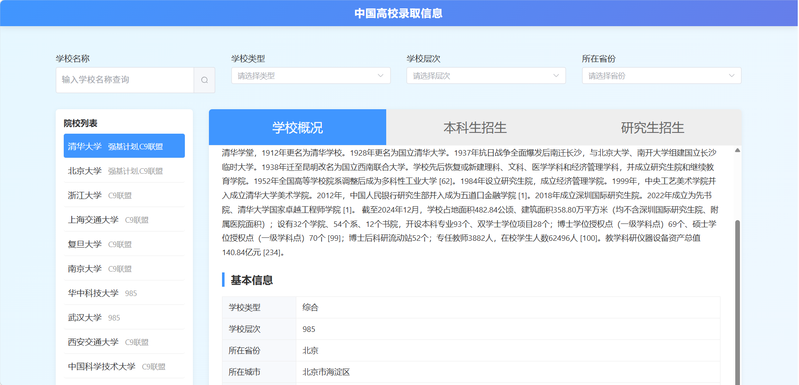
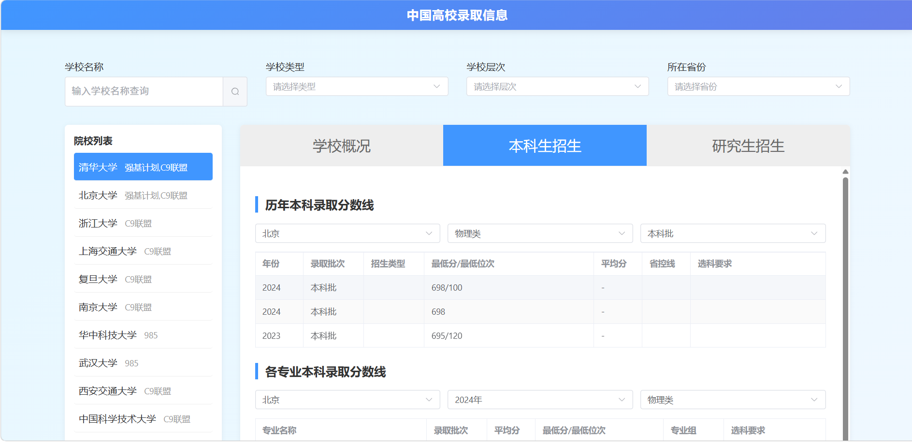

# 中国高校招生数据查询工具

> 一个极简、开源、社区驱动的高考/考研数据查询平台

## 📋 项目简介

**中国高校招生数据查询工具**是一个专为高考和考研考生设计的一站式数据查询平台，旨在解决教育数据分散、查询困难、格式不统一的痛点，让升学决策更加科学、透明。

## 🎯 项目背景

在当今教育信息爆炸的时代，考生和家长面临着诸多挑战：

- **信息分散**：高校招生数据散落在各省市教育考试院、高校官网等多个平台，查询困难
- **格式不一**：不同来源的数据格式各异，难以直接对比分析
- **更新不及时**：手动收集整理数据耗时耗力，难以保证数据的时效性
- **决策困难**：缺乏系统化的数据分析工具，难以做出科学的升学决策

为了解决这些问题，我们创建了这个开源项目，希望通过技术手段，让教育数据更加透明、可及，为每一位考生提供平等的信息获取机会。

## 📸 项目截图

### 高校查询界面


### 招生数据展示


## 🌟 核心特性

- ✅ **一键查询**：快速获取高校录取分数线、位次、人数等关键数据
- ✅ **多维度筛选**：支持按省份、学校类型、层次、年份等多维度筛选
- ✅ **离线使用**：基于SQLite本地数据库，无需联网即可查询
- ✅ **社区驱动**：欢迎贡献数据，共同完善数据库
- ✅ **极简界面**：清爽直观的用户界面，专注于核心功能
- ✅ **跨平台**：支持Windows、Mac、Linux等主流操作系统

## 🚀 快速开始

### 普通用户（推荐）

1. **下载安装包**：从[发布页面](https://github.com/[你的用户名]/China-University-Admission/releases)下载最新安装包
2. **安装运行**：按照安装向导完成安装，双击图标启动应用
3. **开始查询**：选择省份、学校，即可查看录取数据

### 开发者

1. **克隆项目**
   ```bash
   git clone <repository-url>
   cd China-University-Admission
   ```
2. **安装依赖**
   ```bash
   npm run install:all
   ```
3. **启动开发服务器**
   ```bash
   npm run dev
   ```
4. **访问应用**
   - 前端：http://localhost:5173
   - 后端 API：http://localhost:3000

## 📊 当前数据概况

### 高校基础信息
| 类别 | 数量 | 说明 |
| ---- | ---- | ---- |
| 高校总数 | 1167所 | 覆盖全国31个省市自治区 |
| 院校类型 | 12类 | 综合、理工、师范、农林、医药、财经、政法、艺术、体育、民族、语言等 |

### 招生数据
| 类别 | 数量 | 说明 |
| ---- | ---- | ---- |
| 本科录取数据 | 持续更新中 | 清华大学、北京大学等热门高校数据较完整 |
| 研究生录取数据 | 持续更新中 | 部分高校已收录 |

### ⚠️ 数据说明

#### 数据完整度
- **部分省份数据较完整**：北京、上海、广东、江苏、四川等省份的高校招生数据相对完整
- **部分省份数据待补充**：部分省份和高校的招生数据仍在持续收录中，欢迎社区贡献

#### 招生类别说明
不同省份和高校的招生类别可能存在差异，查询时需要注意：

| 常见类别 | 说明 |
| ---- | ---- |
| 理科 | 物理类考生招生批次 |
| 文科 | 历史类考生招生批次 |
| 综合改革 | 新高考省份（如浙江、上海）的招生类别 |
| 物理组/历史组 | 部分省份使用"物理组""历史组"代替传统的文理科分类 |
| 综合 | 部分高校的综合类招生批次 |

**建议**：如果查询不到目标院校的招生数据，可以尝试：
1. 更换不同的"科类"筛选条件（综合改革/物理组/历史组等）
2. 查看不同年份的数据
3. 检查目标高校是否在数据库中

#### 数据来源
数据主要来自各省市教育考试院、高校官网、中国研究生招生信息网等公开渠道。

> 我们持续更新和完善数据，欢迎提交 Pull Request 补充数据！

## 🛣️ 项目路线图

### 已完成

- [x] 基础架构搭建
- [x] 极简前端界面
- [x] SQLite数据库设计
- [x] 1167所高校基础信息
- [x] 基础搜索筛选功能
- [x] 部分高校招生数据

### 进行中

- [ ] 完善更多省份高考数据
- [x] 贡献指南编写
- [x] CSV数据模板创建

### 计划中

- [ ] 支持更多省份高考数据
- [ ] 开发数据校验脚本
- [ ] Electron打包桌面应用
- [ ] 部署在线Demo
- [ ] 移动端适配
- [ ] 数据可视化增强

## 🤝 如何贡献数据

欢迎社区一起补充高校信息、本科录取数据和研究生录取数据。

### 提交前请先了解

- **不需要新建数据库文件**
- **不建议直接修改 `data/test.db`**
- **推荐使用仓库提供的 CSV 模板提交数据**
- 每次提交请尽量聚焦一个学校、一个省份或一类数据，方便审核

### 普通贡献者提交流程

1. **Fork 本仓库**
2. **选择模板**：进入 `data/templates/` 目录，选择对应模板
   - `universities.template.csv`：高校基础信息
   - `undergraduate_admissions.template.csv`：本科招生/录取数据
   - `postgraduate_admissions.template.csv`：研究生招生/录取数据
3. **复制并填写模板**
   - 建议将填写后的文件放到 `data/submissions/`
   - 文件名建议使用：`学校名-省份-年份-数据类型.csv`
   - 例如：`浙江大学-浙江-2024-本科录取数据.csv`
4. **检查数据来源**
   - 请在 CSV 中填写 `source_url`
   - 如果官方页面无法直接引用，请在 Pull Request 描述中补充说明来源
5. **提交 Pull Request**
   - 在 PR 标题中说明学校、年份、省份和数据类型
   - 在 PR 描述中写明数据来源、覆盖范围、是否已自查重复和空值

### 是否必须用 CSV？

是的，**建议所有普通贡献者统一使用 CSV 模板**。

这样做的好处：

- 不需要了解 SQLite 结构
- 方便维护者批量审核和导入
- 能减少字段缺失、顺序错误、命名不统一等问题

### 贡献要求

- 数据应来自高校官网、省教育考试院、中国研究生招生信息网等公开来源
- 请尽量保证字段完整，尤其是学校名称、省份、年份、数据来源
- 如果某些分数字段确实缺失，可以留空，但不要随意填写估算值
- 不要提交与现有记录明显重复的数据
- 如发现现有数据错误，欢迎直接提交修正 CSV 并在 PR 中说明

### 相关文件

- [贡献指南](CONTRIBUTING.md)
- [数据模板目录](data/templates)
- [数据来源说明](docs/DATA_SOURCES.md)

## ⭐ 支持项目

如果这个项目对您有帮助，请点亮Star支持我们！您的每一个Star都是对我们最大的鼓励。

## 🔧 技术栈

- **前端**：Vue 3 + Composition API + Element Plus + TypeScript
- **后端**：Node.js + Express + TypeScript
- **数据库**：SQLite
- **构建工具**：Vite

## 📁 项目结构

```
China-University-Admission/
├── backend/                    # Node.js 后端
│   ├── src/                   # 源代码
│   └── package.json            # 依赖配置
├── frontend/                   # Vue 3 前端
│   ├── src/                   # 源代码
│   └── package.json           # 依赖配置
├── data/                      # 数据库文件与数据模板
│   ├── test.db                # SQLite 数据库
│   ├── templates/            # 社区贡献 CSV 模板
│   └── submissions/          # 建议存放待合并的贡献数据
├── images/                    # 项目截图
├── scripts/                   # 辅助脚本
├── CONTRIBUTING.md            # 数据贡献指南
├── README.md                  # 项目说明
└── LICENSE                    # 许可证
```

## 🔒 合规声明

- 数据来源于公开渠道整理，仅供学习和研究参考
- 请以各高校官方发布信息为准
- 禁止商业用途

## 📄 许可证

本项目采用 MIT 许可证 - 查看 [LICENSE](LICENSE) 文件了解详情。

## 📞 联系方式

- 项目地址：[https://github.com/EvanYao826/China-University-Admission](https://github.com/EvanYao826/China-University-Admission)
- 问题反馈：[Issues](https://github.com/EvanYao826/China-University-Admission/issues)

***

**让数据助力每一位考生的升学之路！** 🎓
